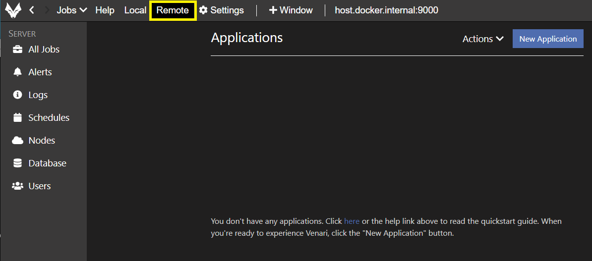
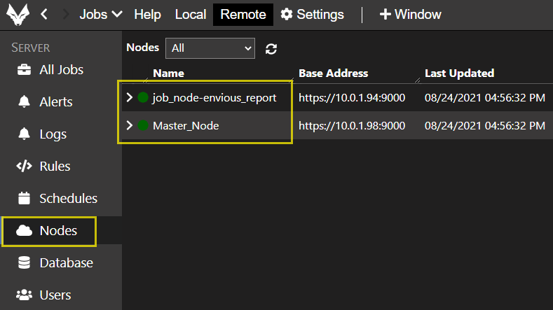

# Venari DevOps Setup

Venari DevOps Edition is a platform for automating web application <u>security testing</u> in CI/CD pipelines. Venari's cross-platform architecture uses distributed job nodes and an orchestrator node to enable authenticated, parallel scanning.  

The steps below describe a simple Docker setup using either docker-compose or swarm that enables one or more job nodes to be deployed in the same stack and network as the orchestrator node.  

## Tutorial Scope

Venari can scale to large deployments, either on-premise or in the cloud.  This guide is restricted to a small deployment primarily aimed at <b>enabling a full evaluation</b> of Venari DevOps Edition.  Public cloud deployments and topics such as Kubernetes are not covered in this document, but the basic principles apply across any Docker-based configuration and Venari works in these environments.

## Concepts

Venari DevOps distributes and controls scan loads across servers running on multiple machines and/or containers.  Upon completing this tutorial, you will have a small scan cluster running and will be able to test unattended, parallel scanning with Venari.  

<br>

<b>The diagram and terms below will help in understanding the directions that follow.</b>

<br>


<br>


### Terms and Definitions

<br>

- <u>Orchestrator Node (Master Node)</u>. Exposes REST APIs for controlling and enqueueing jobs.  These APIs are called by job nodes, the Venari UI and custom DevOps clients.  The orchestrator uses a custom NoSQL database engine to run databases that are containers for application-level data.  Examples are: configuration templates, traffic, findings, and workflows.  The orchestrator also contains high-level job data (summaries, job status, job owners) 

- <u>Job Node</u>.  Exposes REST APIs that provide detailed job data.  Polls the master for a de-queueable job (or an elastic/shared job) in the READY state.  Either runs a dequeued job to run on a single job node  or opts into an elastic job in progress and pulls queue items from the elastic job to speed up throughput and minimize scan time.

- <u>Scan Farm (Scan Cluster)</u>.  A deployment of an orchestrator node and one or more job nodes for running unattended scans under API control.  Scan farms can run more than one scan at a time and can also run specific scans in elastic mode (as shared jobs).  The number of job nodes limits the total concurrency.  Elastic and normal scans can run in parallel on a scan farm when there are enough job nodes available.

- <u>DB (database)</u>.  All Venari nodes run a custom NoSQL database engine that is included with the product.  There is no need to install commercial or open-source databases to run Venari.  All application, scan, configuration, findings, imported artifacts and runtime state data are stored in these databases.  Venari supports a large and growing number of import and export formats to interoperate with popular third-party tools.

- <u>Auth Server</u>. The Venari DevOps platform requires authentication and is compatible with authentication providers that support the OpenID Connect standard.  For the simplified swarm setup used for evaluation, Assert Security provides an authentication server pre-configured inside the orchestrator node.

- <u>Web App Under Test</u>.  The application(s) being scanned by Venari.  These applications can be run in containers, dev/qa environments or in production deployments, but job nodes must be able to resolve the test app URLs in order to make HTTP requests to these applications.  

- <u>Venari UI</u>.  The Venari UI is a cross-platform, installable desktop application that can connect to the orchestrator node to configure scans, review results and start/stop scans.  The details of using the Venari UI are available as a quick start video at <a href ='https://www.youtube.com/watch?v=y_riRONjOTk' target='_blank' >Venari Quick Start</a>.  A later section in this tutorial will show the steps needed to verify successful DevOps setup and UI connectivity.

- <u>REST Client</u>.  The Venari DevOps diagram shows a generic block labelled 'REST Client.'  The master node can be controlled by REST API calls and this block in the diagram is meant to make you aware of this capability.  API control of the master node is not covered in detail in this setup guide.

<br>

## Setting up Venari DevOps

<br>

**PREREQUISITES**  

To setup Venari DevOps and use it in the simple setup described below, you must have already:

1. Requested an evaluation of Venari DevOps edition and received download links and a DevOps license file.
2. Download and Install the Venari UI application (you will license the UI in a later step).
3. Docker must be installed.

### Login to the Assert Security registry

You must login to the Assert Security private container registry before you can pull down Venari images. You should have received an e-mail from Assert Security containing the docker login command to use for our docker repository.  It will be in the below format:

```
docker login -u <user> -p <token> assertsecurity.azurecr.io
```

### Pull the VEnari DevOps Docker Image

```
docker pull assertsecurity.azurecr.io/venari:3.5
```

## Running a DevOps Farm using Docker Compose

<br>

1. Open your terminal or command window to the root directory of this Git source code repository. There should be a file called <u>docker-compose.yaml</u> in the terminal's current directory listing.

2. Execute the following commands in the order shown below.

Windows and Linux:

```
docker-compose --env-file ./settings.env up
```

Mac:

```
docker-compose --env-file ./settings-mac.env up
```

Note that the terminal window will show progress messages as Docker composes the Venari scan farm of one orchestrator node and one job node.  There may be scrolling messages indicating 'The current license is invalid.'  These messages can be ignored because you will input the license info in the next step.


## Running a DevOps Farm using Docker Swarm

<br>

Venari DevOps requires a Docker swarm cluster with at least two separate containers (one for the swarm master node, and one for a job node).  

- The `swarm master`  host server should be allocated 2 CPUs and 8GB RAM. 

- The `swarm worker` host should be allocated 4 CPUs and 16GB RAM, assuming the host server instance will be dedicated to running  `Venari job node` containers only.


### Initialize Docker for Swarm Operation

```
docker swarm init
```

### Configure an overlay network

Using the command below, create an overlay network that will be shared by the master node, job node(s) and the Venari UI.  

```
docker network create -d overlay venari-devops
```

### Create the docker secrets

You will need to create and store a <u>secret</u> for the job node to communicate with the orchestrator node.

From a Bash Prompt:

```bash
uuidgen | docker secret create jobnode-client-secret -
```

### Create SSL/TLS certificate (optional)

In order to have a trusted SSL/TLS connection to the orchestrator node, you can optionally configure an SSL certificate using a .pfx file that you must create within your environment.  If the certificate is self-signed, you will need a .crt file with the public key distributed to end users in order for them to install as a trusted certificate.  Venari will internally generate a self-signed certificate if it is not explicitly configured as a secret.  This will work fine when connecting via the Venari UI, but when accessing the orchestrator node via a browser there will be warnings and depending upon the corporate network connectivity from a browser may not work at all.

```
docker secret create server-ssl-cert.pfx ./server-ssl-cert.pfx
docker secret create server-ssl-cert.pwd ./server-ssl-cert.pwd
```

**Note:** the server-ssl-cert.pwd file contains the password used for the .pfx file.

### Verify Settings in the settings.env file

- Make changes to the PUBLIC_MASTER_BASEURL as appropriate for your environment.  

- Pay attention to the value of the VENARI_IMAGE variable.  Make sure the version specified is the correct version of the product you want to use.

- The `PUBLIC_MASTER_PORT` must be opened for Venari UI to communicate with the `Venari orchestrator node`.


### Deploy the containers

Run the following <b>bash command</b> from the `swarm master node` and from the folder where the  `setting.env` and `docker-stack.yaml` files are saved.

For Windows and Linux:

```bash
source ./settings.env && docker stack deploy -c docker-stack.yaml venari-devops --with-registry-auth
```

For Mac:

```bash
source ./settings-mac.env && docker stack deploy -c docker-stack.yaml venari-devops --with-registry-auth
```

## Setup admin Password and License Information

<b>

The Venari orchestrator node and job node are running but the DevOps license must be supplied to the orchestrator in order to use the product. Follow the steps below to apply the license file.

1. Browse to https://host.docker.internal:9000/ If you get a 'Connection not private' warning you can ignore it since the SSL certificate has not been set up.

2. Create a password for the 'admin' user. The password must contain at least 8 characters.

3. A message screen will show that the license is not configured.  Click the BROWSE button and select the DevOps license file (the file should have a .lic extension).


4. Click the YES button to apply new license.

5. The license is now configured and you can close the browser without clicking anything else.

<br>

## Verify Scan Farm Deployment from Venari UI

<br>

Run the Venari UI and follow these steps to verify that the scan farm is deployed and that the UI can connect and start a scan.

### Apply License Information to the Venari UI

1. Check the ignore certificate errors checkbox
2. Check the 'Use Flex License' checkbox
3. Select 'Professional' from the Product dropdown list
4. Enter https://host.docker.internal:9000 into the master node text input and click OK
5. Enter the admin password you created earlier
6. If the license dialog pops up again click OK

### Connect to Master Node

Click the `Remote` tab and login using the username `admin` and the password you created earlier.


<br>

### Verify that Home Screen is Visible after Logging in

<br>



<br>

### Verify that Nodes Were Created

<br>

Click the `Nodes` tab and verify that a master node and job node are active in the grid on the right hand side of the UI.

<br>



<br>


### Create a Test Application to Verify End to End Functionality

<br>

On the home screen, click 'New Application' button to create a test application. This verifies that the templates and application workspace are created in the master node DB.  

For the example below, we are showing `Google Firing Range` <a href='https://public-firing-range.appspot.com/ '>https://public-firing-range.appspot.com/ </a>which is a publicly available XSS testbed that can be legally scanned.  This Google site does not require a login to see the full site content.  

Follow the steps shown in the animated GIF below to setup a scan of Google Firing Range.

<br>


<br>

After clicking the CREATE button on the application setup screen you should see a list of runnable templates.  Click the play button next to the `Exploit` template.

Verify that the scan is running by looking at the summary screen.  After about 1 minute there should be visible progress in the queue gauges and the UI should be similar to this:

<br>

 

<br>
<br>


## Verify Scan Farm Deployment via Command Line

<br>

### View the swarm deployment progress

```
docker stack services venari-devops
docker stack ps venari-devops
```

### View Venari DevOps log output

```
docker service logs venari-devops_jobnode --follow
docker service logs venari-devops_venarimaster --follow
```

### Test connectivity to the Venari auth server

```
PUBLIC_MASTER_BASEURL:PUBLIC_MASTER_PORT/.well-known/openid-configuration
```

### Test connectivity to master node:

```
PUBLIC_MASTER_BASEURL:PUBLIC_MASTER_PORT/ 
```

### Test IDP information exposed by the master node:

```
PUBLIC_MASTER_BASEURL:PUBLIC_MASTER_PORT/api/auth/idpInfo
```

**Note:**
For the above URLs to work in a browser you may need a trusted SSL certificate configured


**Note:** If running a docker swarm with a single node only (swarm master/worker node on same server instance), remove the `node.role` constraints from the `jobnode` and `venarimaster` service definitions.

<br>

## Shutdown the Venari DevOps farm

<br>

### Docker Compose Shutdown

For Windows and Linux:

```
docker-compose --env-file ./settings.env down
```

For Mac:

```
docker-compose --env-file ./settings-mac.env down
```

### Docker Swarm Shutdown

```
docker stack rm venari-devops
```
